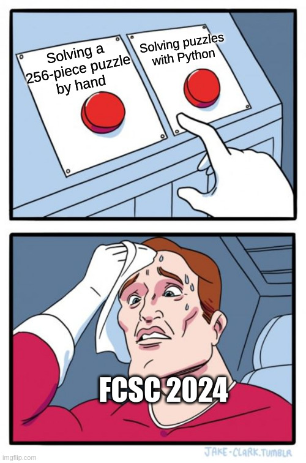

Really ? :)

Hopefully, i already scripted the first one (kinda).
Let's hope that's enough for the 2nd one !

First, we split pieces:
```python
from PIL import Image
import os

def split_image_into_grid(image_path, grid_size=(16, 16), output_folder="Puzzle/hard_pieces"):
    """
    Split an image into a grid (e.g., 8x8) and save each grid cell as a PNG.

    :param image_path: Path to the input image.
    :param grid_size: Tuple indicating the grid size, default is (8, 8).
    :param output_folder: Folder to save the split images.
    """
    # Load the image
    image = Image.open(image_path)
    img_width, img_height = image.size

    # Calculate width and height of each grid cell
    cell_width = img_width // grid_size[0]
    cell_height = img_height // grid_size[1]

    # Create the output folder if it doesn't exist
    if not os.path.exists(output_folder):
        os.makedirs(output_folder)

    # Iterate over the grid and save each cell
    for row in range(grid_size[1]):  # For each row...
        for col in range(grid_size[0]):  # For each column...
            # Calculate the coordinates of the current cell
            left = col * cell_width
            upper = row * cell_height
            right = left + cell_width
            lower = upper + cell_height

            # Crop the current cell out of the full image
            crop = image.crop((left, upper, right, lower))

            # Generate a filename and save the crop
            filename = f"{output_folder}/img_{row}_{col}.png"
            crop.save(filename)

    print(f"Finished splitting the image into {grid_size[0]*grid_size[1]} pieces.")

# Example usage
image_path = "Puzzle/puzzle-trouble-hard.jpg"  # Make sure to replace this with the path to your image
split_image_into_grid(image_path)

```

And using this script:
```python
from PIL import Image
import os
import math
import random

# Set the path to the folder containing puzzle pieces
folder_path = "Puzzle/hard_pieces"

# Function to load all puzzle pieces from the folder
def load_pieces(folder_path):
    pieces = []
    for filename in sorted(os.listdir(folder_path)):
        if filename.endswith(".png"):
            img_path = os.path.join(folder_path, filename)
            img = Image.open(img_path)
            pieces.append(img)
    return pieces

# Function to calculate Euclidean distance between two pixels
def euclidean_distance(pixel1, pixel2):
    r1, g1, b1 = pixel1
    r2, g2, b2 = pixel2
    return math.sqrt((r1 - r2) ** 2 + (g1 - g2) ** 2 + (b1 - b2) ** 2)

# Function to compare the borders of two images
def compare_borders(image1, image2):
    border1 = [image1.getpixel((image1.width - 1, y)) for y in range(image1.height)]
    border2 = [image2.getpixel((0, y)) for y in range(image2.height)]
    diff = sum(euclidean_distance(p1, p2) for p1, p2 in zip(border1, border2))
    return diff

# Function to rebuild the puzzle
def rebuild_puzzle(pieces):
    puzzle_size = (16, 16)
    puzzle = Image.new('RGB', (puzzle_size[0] * pieces[0].width, puzzle_size[1] * pieces[0].height))
    
    for _ in range(10):  # 10 iterations
        random.shuffle(pieces)  # Shuffle the pieces for each iteration
        
        # Start by creating rows
        rows = []
        current_row = []

        if not pieces:
            break

        current_row.append(pieces.pop(0))
        
        while pieces:
            if current_row:
                best_fit = min(pieces, key=lambda piece: compare_borders(current_row[-1], piece))
                best_diff = compare_borders(current_row[-1], best_fit)
                for piece in pieces:
                    if compare_borders(current_row[-1], piece) < best_diff:
                        best_fit = piece
                        best_diff = compare_borders(current_row[-1], best_fit)
                        break

                next_piece = best_fit
            else:
                next_piece = random.choice(pieces)
            pieces.remove(next_piece)
            current_row.append(next_piece)
            
            if len(current_row) == puzzle_size[0]:
                rows.append(current_row)
                current_row = []
        
        # Arrange rows to form the puzzle
        for y, row in enumerate(rows):
            for x, piece in enumerate(row):
                puzzle.paste(piece, (x * piece.width, y * piece.height))
    
    return puzzle

# Main function
def main():
    # Load puzzle pieces
    pieces = load_pieces(folder_path)
    
    # Rebuild the puzzle
    puzzle = rebuild_puzzle(pieces)
    
    # Display or save the puzzle
    puzzle.show()
    # puzzle.save("reconstructed_puzzle.png")  # Uncomment this line to save the puzzle as an image file

if __name__ == "__main__":
    main()

```

Not that bad !


Let's Gimp a bit, and if it takes too much time i'll try another approach.

Edit:It took too much time.
But i was too lazy to try another approach, so here's what i've built !


Which gives the flag:
FCSC{93784AE384999121FE3123441984}