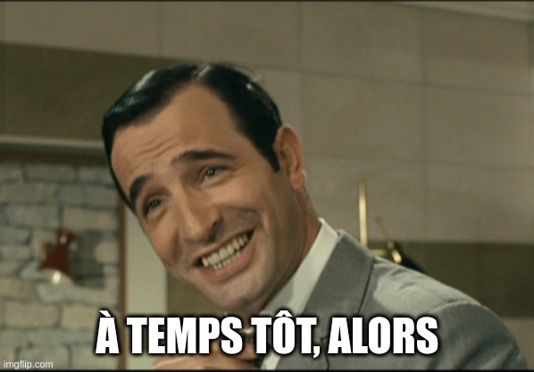

The program want you to have the same min_date than max_date when importing from the system.

I tried to patch the binary to change the JNZ into a JZ, and i get a different prompt:

I didn't know this error, but i've seen a simmilar one in many binaries: "this program cannot be ran in DOS mode".

So maybe i'll try to run this program with a DOS emulator ?

Same happens...
Mhh.

